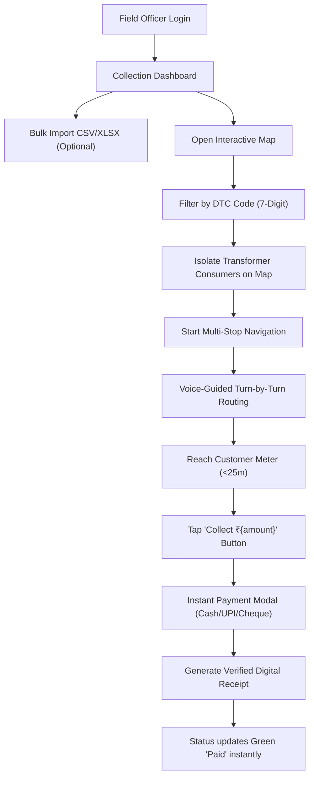

# ⚡ Mahavitaran - Field Officer Electricity Bill Collection & GIS Navigation System
### Comprehensive Technical Architecture & Operations Manual

---

## 📌 1. Executive Summary & Project Overview

The **Mahavitaran Field Officer Electricity Bill Collection & Navigation System** is an enterprise-grade, full-stack operational suite engineered for electricity distribution companies (such as MSEDCL / Mahavitaran). 

The platform bridges real-time distribution transformer telemetry, meter locations, and field officer recovery workflows. It equips field officers with live turn-by-turn routing, 360° street view inspection, transformer-wise consumer grouping, zero-latency payment collection, and instant digital receipt generation.

### Key Objectives Solved:
- **Distribution Transformer Center (DTC) Grouping**: Aggregates consumers under their physical 7-digit transformer centers (DTCs), allowing field officers to service consumers cluster-by-cluster.
- **Turn-by-Turn In-Field Navigation**: Real-time GPS navigation with dynamic voice maneuver guidance (Web Speech API) and route deviation detection.
- **Zero-Latency In-Map Payment Collection**: Instant bill collection directly from map marker popups with zero tap delay.
- **Bulk CSV / Excel Ingestion**: Standardized 9-column import template with leading-zero preservation and automatic transformer clustering.
- **Offline Collection Resilience**: Local queueing of transactions when mobile network connectivity is lost in rural/remote zones, auto-syncing when back online.

---

## 🛠️ 2. Technology Stack

### Backend
| Layer | Technology | Details |
| :--- | :--- | :--- |
| **Framework** | **FastAPI** (Python 3.12) | High-performance asynchronous ASGI REST API framework |
| **Database** | **MongoDB Atlas** | Document storage with Motor async client & `2dsphere` geospatial indexing |
| **Authentication** | **JWT (JSON Web Tokens)** | Bearer tokens with BCrypt / Passlib password hashing |
| **Routing Engine** | **OSRM & Google Routes API** | Multi-stop Traveling Salesperson Problem (TSP) routing and step maneuvers |
| **Data Processing** | **OpenPyXL & Python CSV** | High-throughput spreadsheet parsing with automated header alias normalization |

### Frontend
| Layer | Technology | Details |
| :--- | :--- | :--- |
| **Framework** | **Next.js 14** (App Router) | Modern React with Server and Client Components, TypeScript |
| **Styling** | **Tailwind CSS & CSS3** | Clean slate/blue enterprise design system with responsive mobile-first layouts |
| **GIS Mapping** | **Leaflet & Leaflet Routing Machine** | Interactive vector tiles, custom SVG markers, and live route polylines |
| **Voice TTS** | **Web Speech API** | Dynamic turn-by-turn voice maneuver guidance and destination announcements |
| **Icons** | **Lucide React** | Consistent SVG iconography |

---

## 🗄️ 3. Database Architecture & Collections (MongoDB)

Database Name: `electricity_collection`

### 3.1 `customers` Collection
Stores consumer profile details, GIS coordinates, assigned DTC transformer, and live billing status.

```typescript
interface Customer {
  _id: ObjectId;
  customer_id: string;             // e.g. "CUS10050"
  name: string;                    // e.g. "Rajesh Kumar"
  meter_number: string;            // e.g. "MTR89901"
  dtc_code: string;                // 7-digit DTC Code, e.g. "0441001", "7865785"
  phone?: string;                  // e.g. "+91 9822000000"
  email?: string;
  address: string;                 // e.g. "Plot 12, Civil Lines"
  area: string;                    // e.g. "Civil Lines", "Dharampeth"
  latitude: number;                // e.g. 21.1458
  longitude: number;               // e.g. 79.0882
  location: {                      // Indexed with 2dsphere for geospatial proximity
    type: "Point";
    coordinates: [number, number]; // [longitude, latitude]
  };
  pending_amount: number;          // Outstanding dues in INR (e.g. 4500.0)
  due_date: string;                // "YYYY-MM-DD"
  status: "pending" | "overdue" | "paid";
  priority: "normal" | "high";
  assigned_officer_id?: string;    // e.g. "OFF-1001"
  uploaded_by_officer_id?: string;
  created_at: string;
  updated_at: string;
}
```

### 3.2 `meters` Collection
Maintains electric meter records linked to customer IDs and officer routes.
- `meter_id`: e.g. `MTR-89901`
- `meter_number`: Unique meter serial number
- `customer_id`: Linked customer ID
- `latitude` / `longitude`: Meter installation coordinates
- `assigned_officer_id`: Designated field officer

### 3.3 `payments` Collection
Complete immutable audit trail of all field collections.
- `payment_id`: e.g. `PAY-78A1B2`
- `receipt_number`: e.g. `REC-2026-90021`
- `customer_id`: Paying consumer
- `amount`: Collected INR amount
- `payment_method`: `cash` | `upi` | `cheque` | `other`
- `collection_latitude` & `collection_longitude`: GPS coordinates where payment was collected
- `previous_pending_amount` & `remaining_pending_amount`
- `bill_status`: Updated status (`paid` or `partially_paid`)
- `created_at`: Timestamp

---

## ⚡ 4. Detailed Breakdown of New System Changes

### 4.1 7-Digit Distribution Transformer Center (DTC) Grouping
In power distribution networks, multiple consumers receive low-tension (LT) electricity from a single Distribution Transformer Center (DTC).
- **Multi-Customer Association**: Each 7-digit DTC code (e.g. `0441001`, `7865785`) holds a cluster of consumers (typically 3 to 7 consumers per transformer in the active dataset).
- **Interactive Map DTC Filter**:
  - Located under the top search bar filter drawer on `/map`.
  - Displays dynamic pills with active customer counts: e.g., `All DTCs (42)`, `0441001 (2)`, `7865785 (5)`, `7865790 (7)`.
  - Selecting any DTC immediately isolates and displays only the pins belonging to that transformer, recalculating the multi-stop route exclusively for those consumers.
- **Customer Directory Table Column**: Added a dedicated **DTC Code** column in `/customers` showing an amber badge: `⚡ 7865785`.
- **Customer Details Profile**: Displays the transformer code in both the profile header status row and the **Electricity Meter Details** card.
- **Add Consumer Modal**: Includes a validated 7-digit DTC Code input field.

### 4.2 Standardized Bulk CSV / Excel Import Template
The Bulk Upload modal on the Dashboard (`/dashboard`) and Customer Directory (`/customers`) features an upgraded template download and parser.

#### Supported 9 Columns:
1. `cus_id`: Consumer identification number (e.g. `CUS10050`)
2. `cons_no`: Consumer name (e.g. `Rajesh Kumar`)
3. `meter_id`: Meter number (e.g. `MTR89901`)
4. `dtc_code`: 7-digit transformer code (e.g. `0441001`)
5. `latitude`: GPS latitude (e.g. `21.1458`)
6. `longitude`: GPS longitude (e.g. `79.0882`)
7. `total_due_amt`: Pending electricity bill amount in INR (e.g. `4500`)
8. `address`: Consumer physical street address (*optional*, quotes supported for commas)
9. `area`: Sub-division / ward name (*optional*)

#### Built-in Normalization Features:
- **Leading-Zero Retention**: Automatically formats numeric strings with `.zfill(7)` so codes like `0441001` or Excel-truncated `441001` are correctly stored with leading zeros intact.
- **Flexible Header Aliases**: Maps aliases such as `dtc`, `dtc code`, `transformer`, `lat long`, `total due amt`, etc.
- **Sample Template Download**: Direct one-click download of `sample_customers_import.csv` with pre-filled test rows.

### 4.3 Zero-Latency "Collect Payment" Button
Resolved the latency and unresponsiveness previously experienced when tapping the map popup collection button.
- **Direct Inline Fast-Path Handler**: Uses `onclick="window.__handleCollectPayment('${customer.customer_id}', event)"` directly in the HTML string, guaranteeing the button is immediately bound upon DOM generation and never lost when `setPopupContent()` is invoked.
- **Capture-Phase Delegation**: Added `pointerdown`, `mousedown`, and `click` listeners with `capture: true` on the map container to intercept clicks before Leaflet's map panning engine can delay or swallow the event.
- **Propagation Safeguards**: Disabled Leaflet click and scroll propagation (`L.DomEvent.disableClickPropagation`) on the popup element.
- **Touch Latency Removal**: Applied `touch-action: manipulation` and `-webkit-tap-highlight-color: transparent` to eliminate mobile 300ms gesture delays.
- **Synchronous Modal Mounting**: Added a dedicated `paymentCustomer` state to immediately mount and prefill the payment modal in the same tick.

---

## 📡 5. Backend REST API Reference

All API routes run on `http://127.0.0.1:8000`.

### Authentication
- `POST /api/auth/login`: Authenticate field officer with email & password. Returns JWT access token.
- `POST /api/auth/register`: Create a new field officer account.

### Customers
- `GET /api/customers`: List customer records.
  - **Query Params**:
    - `?dtc_code=`: Filter by specific 7-digit DTC transformer (e.g. `7865785`).
    - `?all_officers=true`: View all consumers regardless of officer assignment.
    - `?status=`: Filter by `pending`, `overdue`, or `paid`.
    - `?area=`: Filter by neighborhood / ward.
    - `?search=`: Search by name, customer ID, or meter number.
- `GET /api/customers/{customer_id}`: Fetch single customer with associated meters and assigned officer details.
- `POST /api/customers`: Create a single consumer record (accepts `dtc_code`).
- `POST /api/customers/upload`: Bulk import CSV or Excel (.xlsx) file.

### Payments
- `POST /api/payments/collect`: Process payment collection (updates customer balance, creates receipt record).
- `GET /api/payments`: Query payment collection history.
- `GET /api/payments/{id}/receipt`: Fetch printable digital receipt details.

### Routes & Navigation
- `POST /api/routes/calculate`: Single destination route calculation from officer GPS to customer meter.
- `POST /api/routes/calculate-multi`: Traveling Salesperson Problem (TSP) multi-stop optimized route connecting all filtered consumers.

---

## 🚀 6. Installation & Local Development Setup

### Prerequisites
- Python 3.10 or higher
- Node.js 18 or higher & npm
- MongoDB Atlas connection string (or local MongoDB on port 27017)

---

### Step 1: Backend Setup
```bash
# 1. Navigate to backend directory
cd backend

# 2. Activate virtual environment
# Windows (PowerShell):
.\venv\Scripts\Activate.ps1
# Linux/macOS:
source venv/bin/activate

# 3. Install dependencies
pip install -r requirements.txt

# 4. Verify environment configuration in backend/.env
MONGODB_URI=mongodb+srv://<username>:<password>@<cluster>.mongodb.net/?appName=Cluster0
DATABASE_NAME=electricity_collection
JWT_SECRET=super-secret-jwt-key-change-in-production-2026
ALLOWED_ORIGINS=http://localhost:3000

# 5. Start the backend server
uvicorn app.main:app --host 127.0.0.1 --port 8000 --reload
```
API Documentation: [http://127.0.0.1:8000/docs](http://127.0.0.1:8000/docs)

---

### Step 2: Frontend Setup
```bash
# 1. Navigate to frontend directory
cd frontend

# 2. Install dependencies
npm install

# 3. Verify environment configuration in frontend/.env.local
NEXT_PUBLIC_API_URL=http://localhost:8000

# 4. Start Next.js development server
npm run dev
```
Web Application: [http://localhost:3000](http://localhost:3000)

---

### Default Officer Credentials
- **Email**: `officer1@electricity.gov.in`
- **Password**: `officer123`

---

## 📄 7. Sample Bulk CSV Import File

Save as `sample_customers_import.csv`:

```csv
cus_id,cons_no,meter_id,dtc_code,latitude,longitude,total_due_amt,address,area
CUS10050,Rajesh Kumar,MTR89901,0441001,21.1458,79.0882,4500,"Plot 12, Civil Lines",Civil Lines
CUS10051,Pooja Sharma,MTR89902,0441002,21.1390,79.0720,1850,"Shop 5, Commercial Market",Dharampeth
CUS10052,Anil Deshmukh,MTR89903,0441001,21.1245,79.0680,8900,"Block 4, Bajaj Nagar",Bajaj Nagar
```

---

## 📱 8. User Flow Walkthrough



---

## 🔒 9. Security & Governance

- **Token-Based Access**: Role-based JWT validation across all mutation and query endpoints (`require_officer` dependency).
- **Data Integrity**: Audited collections with GPS geotags (`collection_latitude`, `collection_longitude`) recorded for every collection transaction.
- **Duplicate Prevention**: Unique indexing on `customer_id`, `meter_number`, and `receipt_number`.
- **CORS Restricted**: Controlled origin authorization for Next.js client instances.
